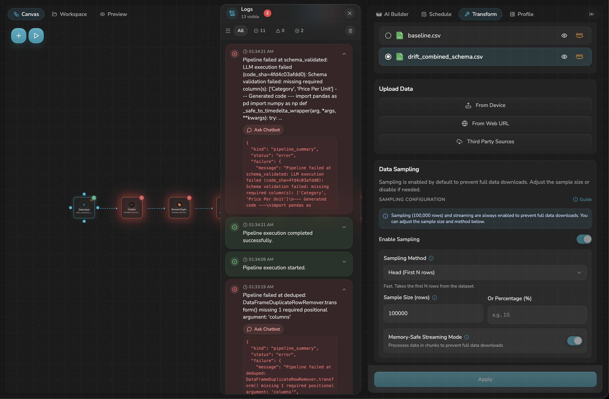
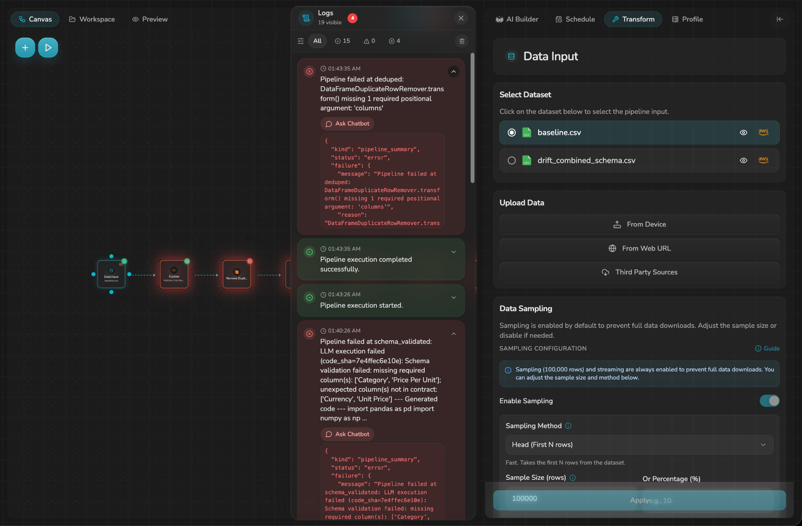
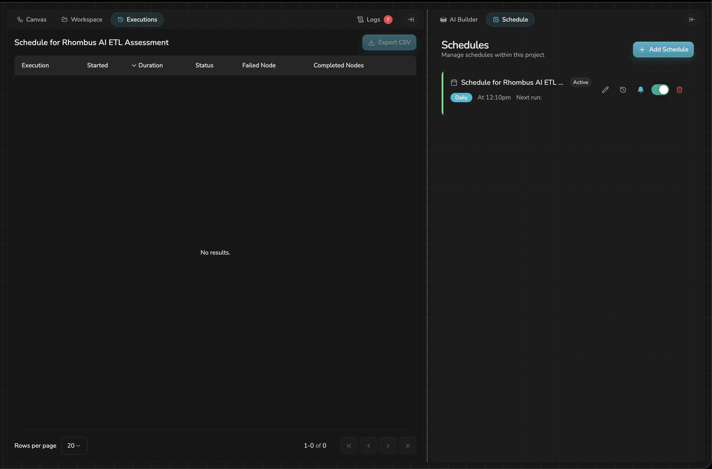
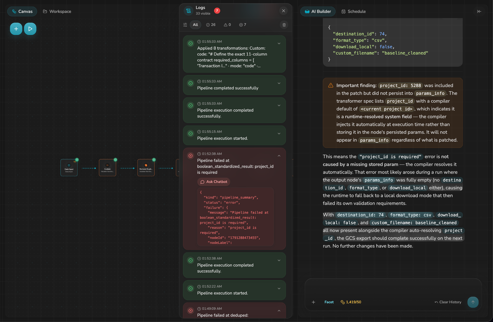

# Combined Schema Drift

## Scenario

This test introduced all four required schema-drift conditions together using `datasets/drift_combined_schema.csv`.

Changes from the baseline:

- Removed `Category`.
- Renamed `Price Per Unit` to `Unit Price`.
- Changed 100 non-empty `Quantity` values to `INVALID_QUANTITY`.
- Added a new `Currency` column containing `AUD`.

The drifted dataset contains 12,575 rows and 11 columns.

## Expected Behaviour

The pipeline should detect that the incoming schema no longer matches the expected baseline contract and stop before invalid data reaches Google Cloud Storage.

Ideally, the error should identify all structural differences in one run so an operator can understand the complete schema change without repeatedly fixing and rerunning the pipeline.

## Initial Result

After selecting `drift_combined_schema.csv` as the pipeline input, the pipeline stopped at `schema_validated`.

The initial error reported:

    Schema validation failed: missing required column(s): ['Category', 'Price Per Unit']

This correctly detected the two missing expected columns.

However, the same input also contained the unexpected columns `Currency` and `Unit Price`. These were not reported because the validator raised immediately after detecting the missing columns.

Evidence:

## Chatbot Diagnosis

The Rhombus AI chatbot correctly identified that the schema validator performed the missing-column and extra-column checks sequentially.

Because the missing-column check raised an exception first, execution never reached the extra-column check.

The chatbot recommended collecting both sets of violations before raising a single error.

## Chatbot Fix

The chatbot modified only the error-handling logic in `schema_validated` so that both checks execute before the exception is raised.

After applying the fix and rerunning the same combined-drift input, the validator reported:

    Schema validation failed: missing required column(s): ['Category', 'Price Per Unit']; unexpected column(s) not in contract: ['Currency', 'Unit Price']

This improved the diagnostic because all structural schema violations were surfaced in a single run.

Evidence:

## Quantity Type Drift

The `INVALID_QUANTITY` values are not themselves structural column drift.

If execution reaches `numeric_enforced`, the existing cleaning rule converts invalid numeric values to missing values rather than fabricating replacements.

In this combined test, schema validation stopped execution earlier because of the missing and unexpected columns.

## Schedule Behaviour

The schedule remained configured and Active after the combined schema-drift failure.

The schedule UI continued to show:

- Daily schedule.
- 12:10pm configured time.
- Active status.
- Enabled toggle.

The Executions view showed `No results`, limiting visibility into scheduled execution history.

Evidence:

## Additional Finding During Recovery

After the chatbot-driven schema-validator modification, subsequent compile operations caused configuration parameters on non-LLM nodes to disappear.

Observed examples included:

- `deduped` losing its `columns` and `keep` parameters.
- `boolean_standardized_result` losing its GCS output parameters.

Restoring the affected parameters individually resulted in configuration being lost again during later compile operations. Both affected configurations eventually had to be restored together in a single compile operation.

This behaviour was separate from schema-drift detection itself, but is important because applying a chatbot-generated fix affected previously working pipeline configuration.

## Baseline Restoration

After testing, `baseline.csv` was restored as the selected source and the affected node configuration was repaired.

A later clean baseline execution completed successfully.

Supporting evidence:

## Result Summary

| Question | Result |
|---|---|
| Did the combined drift stop the pipeline? | Yes |
| Were missing columns detected? | Yes |
| Were unexpected columns initially reported? | No |
| Did the chatbot diagnose the incomplete error correctly? | Yes |
| Did the chatbot fix improve schema diagnostics? | Yes |
| Did the fix have side effects? | Yes - subsequent compile operations affected non-LLM node parameters |
| Did invalid Quantity values reach numeric cleaning? | No - schema validation stopped execution first |
| Did the schedule remain enabled? | Yes |
| Was scheduled execution history clearly visible? | No - Executions showed `No results` |
| Final baseline restored? | Yes |

## Severity

**High**

The pipeline correctly prevents structurally incompatible data from reaching the destination. However, the initial error did not expose the complete schema mismatch, and chatbot-driven compile operations introduced configuration regressions in previously working nodes. These behaviours increase recovery time and make automated remediation riskier.
